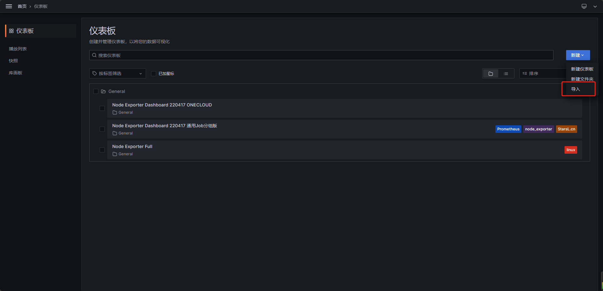

# 快速搭建Prometheus监控

## 目录

- [快速搭建Prometheus监控](#快速搭建prometheus监控)
  - [目录](#目录)
    - [OVERVIEW 概述](#overview概述)
      - [What is Prometheus? 什么是普罗米修斯？](#what-is-prometheus什么是普罗米修斯)
      - [组件架构图](#组件架构图)
    - [快速部署Prometheus \& grafana实例](#快速部署prometheus--grafana实例)
      - [docker-compose.yml](#docker-composeyml)
      - [node\_exporter.sh](#node_exportersh)
      - [prometheus.yml](#prometheusyml)
      - [grafana](#grafana)

### OVERVIEW 概述

<https://prometheus.io/docs/introduction/overview/>

#### What is Prometheus? 什么是普罗米修斯？

Prometheus是一个开源系统监控和警报工具包，最初是在SoundCloud上构建的。自 2012 年成立以来，许多公司和组织都采用了 Prometheus，该项目拥有非常活跃的开发人员和用户社区。它现在是一个独立的开源项目，独立于任何公司进行维护。为了强调这一点，并澄清项目的治理结构，Prometheus于2016年加入了云原生计算基金会，成为继Kubernetes之后的第二个托管项目。

Prometheus 收集其指标并将其存储为时间序列数据，即指标信息与记录它的时间戳一起存储，以及称为标签的可选键值对。

#### 组件架构图


***

### 快速部署Prometheus & grafana实例

项目链接：[dhwark/grafana-tutorial: Grafana 使用教程 (github.com)](https://github.com/dhwark/grafana-tutorial "dhwark/grafana-tutorial: Grafana 使用教程 (github.com)")

#### docker-compose.yml

此compose文件会启动两个容器：

prometheus是prometheus主程序，包含完整组件

grafana就是监控面板

在启动前请检查防火墙端口规则，grafana默认占用3000端口，Prometheus占用9090端口

准备就绪后使用`docker-compose up -d`启动服务

compose文件如下：

```bash
version: '3.4'
services:
  prometheus:
    image: prom/prometheus
    container_name: prometheus
    hostname: prometheus
    ports:
      - 9090:9090
    volumes:
      - ./prometheus.yml:/etc/prometheus/prometheus.yml

  grafana:
    image: grafana/grafana
    container_name: grafana
    hostname: grafana
    ports:
      - 3000:3000
    volumes:
      - ./grafana.ini:/etc/grafana/grafana.ini
```

***

#### node\_exporter.sh

`node_exporter` 使用9100端口

此脚本是在宿主机上安装`node_exporter`采集数据，程序由go语言编写，无需编译直接运行，脚本中配置成systemd服务来管理。


#### prometheus.yml

此文件中需添加你的数据采集对象：

```bash
scrape_configs:
- job_name: <节点名>
  static_configs:
  - targets: ['ip:9100'] # 改为你监控端的ip
```

此处为宿主机就添加宿主机ip，不要使用localhost！

安装完毕node\_exporter后可以在：http\://ip:9090/targets?search=

查看节点状态，显示up即为采集成功，如果失败请检查配置文件中的ip地址


***

#### grafana

节点配置完毕就可以开始配置监控面板了，登录grafana页面，默认用户名/密码：admin

1.  添加数据源，选择Prometheus


2. 填入Prometheus地址


点击页面底部的save\&test


3. 找到dashboard页面导入模板



grafana支持丰富的模板定义！我们可以在官网找到我们喜欢的模板导入：

[Dashboards | Grafana Labs](https://grafana.com/grafana/dashboards/ "Dashboards | Grafana Labs")

node\_exporter可以使用此模板，中文监控模板id：220417


4. 模板展示

自此我们已经完成了所有组建的部署，并成功开启了一个展示模板！


